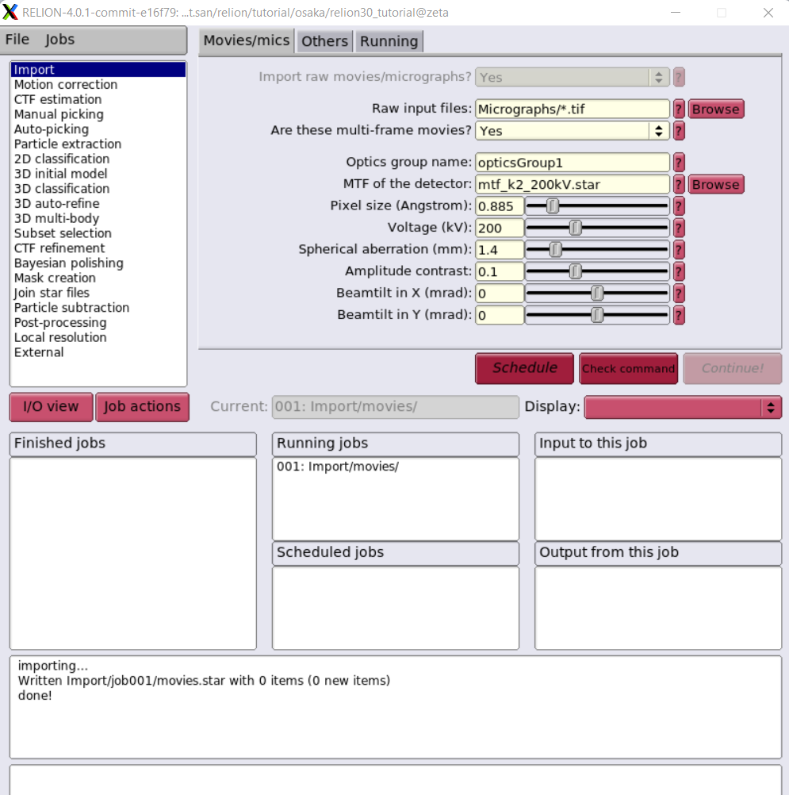

Cryogenic electron microscopy
=================================

Cryogenic electron microscopy (cryoEM) is a cryomicroscopy technique applied on samples cooled to cryogenic temperatures. For biological specimens, the structure is preserved by embedding in an environment of vitreous ice. 
`Cryogenic electron microscopy <https://en.wikipedia.org/wiki/Cryogenic_electron_microscopy#:~:text=Cryogenic%20electron%20microscopy%20(cryoEM)%20is,an%20environment%20of%20vitreous%20ice.>`_

Relion 4.0 for cryo-EM structure determination
===============================================
Relion-4 cover  the entire single-particle analysis workflow in relion-4.0: beam-induced motion-correction, CTF estimation; automated particle picking; particle extraction; 2D class averaging; automated 2D class selection; SGD-based initial model generation; 3D classification; high-resolution 3D refinement; CTF refinement and higher-order aberration correction; the processing of movies from direct-electron detectors; and final map sharpening and local-resolution estimation. 
`RELION 4.0 Document  <https://relion.readthedocs.io/en/release-4.0/SPA_tutorial/Introduction.html>`_

Relion 3 or 4 on Exascale Cluster with Singularity
--------------------------------------------------
This is very simple guide to run Relion on a DGX100, more effective multinodes should be explore futher.
Assume you allocate resource on one of our compute nodes by salloc command.
.. code-block:: console

   $ salloc -w omega -t 1:0:0 --gres=gpu:1

Download Data
-------------
You can download data from Takayuki Kato from the Namba group at Osaka university, Japan. It was collected on a JEOL CRYO ARM 200 microscope.The data and our precalculated results may be downloaded and unpacked using the commands below.

.. code-block:: console

   cd ~/
   mkdir relion/tutorial/
   wget ftp://ftp.mrc-lmb.cam.ac.uk/pub/scheres/relion30_tutorial_data.tar
   wget ftp://ftp.mrc-lmb.cam.ac.uk/pub/scheres/relion40_tutorial_precalculated_results.tar.gz
   tar -xf relion30_tutorial_data.tar
   tar -zxf relion40_tutorial_precalculated_results.tar.gz

Signle particle tutorial
-------------------------
.. code-block:: console
  
   $ singularity shell --nv /app/relion4_gui_cufftw.sif
   Singularity> relion &

This image is NOT the best one which we will improve Singularity definition file to run on multi-nodes with Slurm scheduling.

`RELION Single particle tutorial  <https://relion.readthedocs.io/en/release-4.0/SPA_tutorial/index.html>`_

Computational Imaging System for Transmission Electron Microscopy(cisTEM)
=========================================================================
cisTEM is user-friendly software to process cryo-EM images of macromolecular complexes and obtain high-resolution 3D reconstructions from them. It was originally developed by Tim Grant, Alexis Rohou and Nikolaus Grigorieff and comprises a number of tools to process image data including movies, micrographs and stacks of single-particle images, implementing a complete “pipeline” of processing steps to obtain high-resolution single-particle reconstructions. cisTEM is distributed under the Janelia Research Campus Software License and can be downloaded here. We recommend downloading and using the pre-compiled binaries, rather than compiling the source code, for best performance. New users are encouraged to follow the tutorial, which provides a quick way to become familiar with the most important functions of cisTEM.

`cisTEM   <https://cistem.org/>`_
Run cisTEM on a DGX-A100 
------------------------
.. code-block:: console

   $ salloc -w omega -t 1:0:0 --gres=gpu:1

Download Data
-------------
To test programm we will need to download the apoferritin test dataset from the cisTEM web page. It comes as 
another archive called apoferritin_data.tar.gz and is attached to the “Getting Started” 
Documentation page. Store this archive on a fast local disk where you have about 15 GB of space and unpack it 
by typing:
.. code-block:: console

   $  tar -xzf apoferritin_data.tar.gz

New folder apoferritin_data  contains 20 movies, recorded on an 
aberration-corrected Titan Krios microscope.
To use X11 Window client, check DISPLAY environment as follow:

.. code-block:: console

   $ env | grep DISPLAY

Take notes for DISPAY such as *DISPLAY=:10.0*, then la

